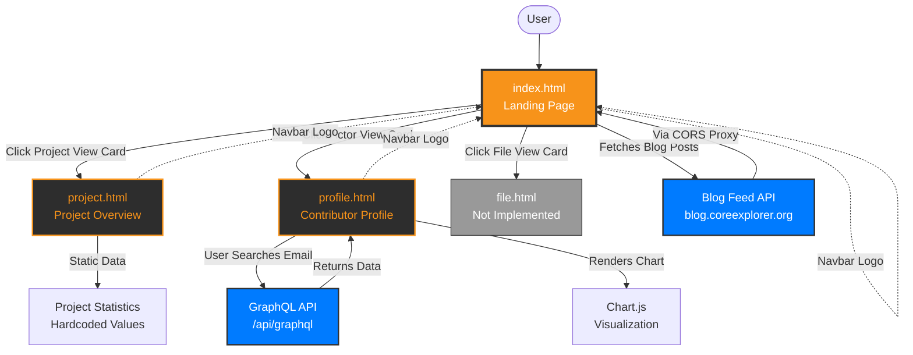
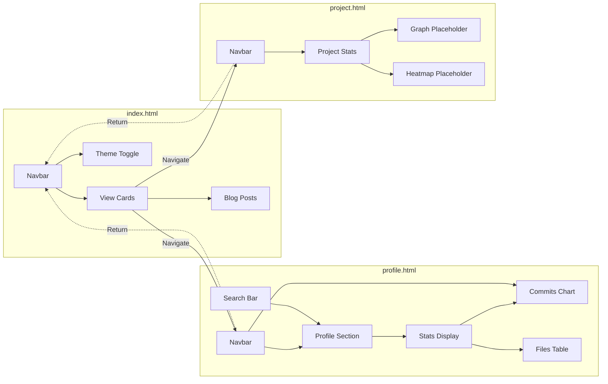
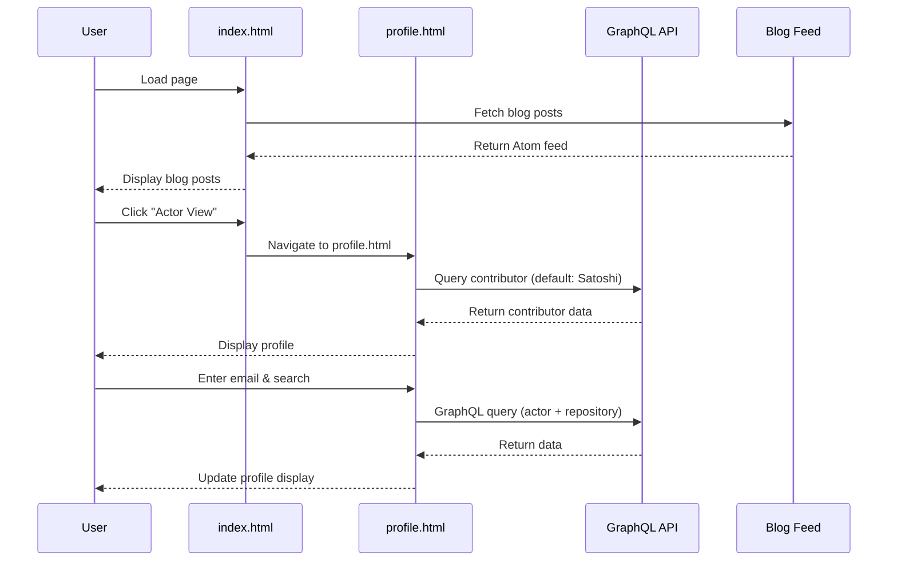

# Core Explorer Frontend - Interaction Diagram

## Visual Flow Diagram

## Component Interaction Diagram

## Data Flow Diagram

## Feature Matrix

| Feature | index.html | profile.html | project.html |
|---------|-----------|--------------|--------------|
| Navigation Bar | ✅ | ✅ | ✅ |
| Theme Toggle | ✅ | ✅ | ✅ |
| Search Bar | ⚠️ (UI only) | ✅ (Functional) | ⚠️ (UI only) |
| API Integration | ✅ (Blog feed) | ✅ (GraphQL) | ❌ |
| Data Visualization | ❌ | ✅ (Chart.js) | ⚠️ (Placeholders) |
| Responsive Design | ✅ | ✅ | ✅ |
| External Links | ✅ (GitHub, Email) | ✅ (GitHub, Email) | ✅ (GitHub, Email) |

**Legend:**
- ✅ Fully implemented
- ⚠️ Partially implemented
- ❌ Not implemented

## Key Interactions Summary

1. **Navigation**: 
   - `index.html` serves as the hub with navigation cards
   - Both `profile.html` and `project.html` can return via navbar logo
   - Direct URL access to any page is supported

2. **Data Fetching**:
   - `index.html`: Fetches blog posts on page load
   - `profile.html`: Fetches contributor data on search or page load (default)
   - `project.html`: No data fetching (static content)

3. **Shared State**:
   - Theme preference is not persisted (resets on navigation)
   - All pages share the same CSS variables and styling
   - Navigation structure is consistent across all pages

4. **User Interactions**:
   - Theme toggle: Works on all pages independently
   - Search: Only functional on `profile.html`
   - Navigation: Card clicks and navbar logo clicks

